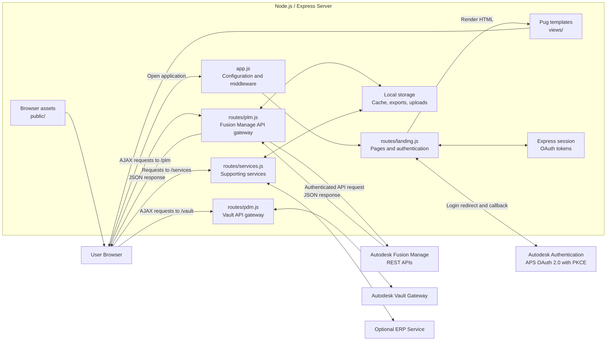
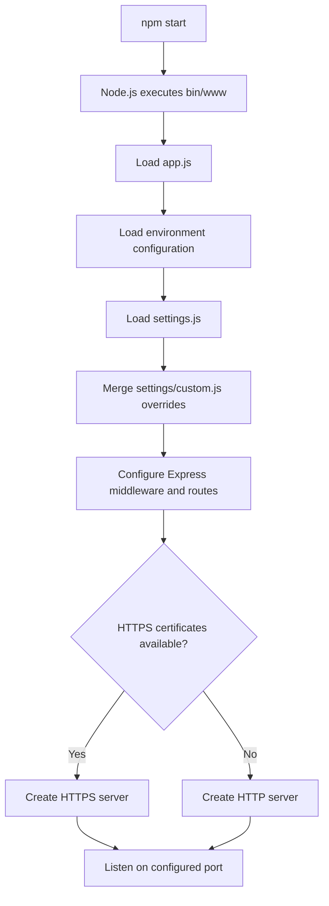
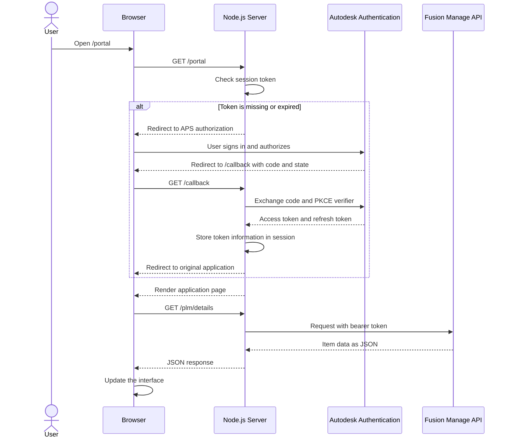
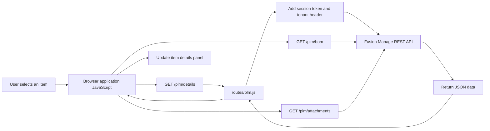

# PLM Extensions: Node.js Solution Architecture

## 1. Overview

PLM Extensions is a Node.js and Express web application that provides alternative user interfaces for Autodesk Fusion Manage.

The solution does not replace Fusion Manage. It operates as an application layer between the user's browser and Autodesk services. It authenticates users, renders application pages, forwards data requests to Autodesk APIs, and returns the resulting information to the browser.

Fusion Manage remains the primary system of record. Local folders are used mainly for temporary processing, caching, uploads, imports, and exports.

## 2. High-Level Architecture



## 3. Main Technologies

| Technology | Purpose |
|---|---|
| Node.js | Executes the server-side JavaScript application |
| Express | Handles HTTP requests, middleware, routing, and sessions |
| Pug | Generates HTML pages on the server |
| Axios | Sends requests from Node.js to Autodesk and external APIs |
| jQuery | Handles browser events and AJAX requests |
| Express Session | Keeps authentication information associated with a user session |
| ExcelJS | Generates and processes Excel documents |
| Chart.js | Displays charts in selected applications |
| DataTables | Provides interactive data tables |

## 4. Starting the Application

The start command is defined in `package.json`:

```json
{
  "scripts": {
    "start": "node --max-http-header-size=16384 ./bin/www"
  }
}
```

The application can be installed and started locally with:

```powershell
npm install
npm start
```

The default callback URL is `http://localhost:8080/callback`, so the normal local address is:

```text
http://localhost:8080
```

### Startup Flow



The `bin/www` file creates either an HTTP or HTTPS server. HTTPS is used when the expected certificate files are available in the `keys` directory. Otherwise, the application falls back to HTTP.

## 5. Configuration

The application uses two categories of configuration.

### 5.1 Connection Configuration

`environment.js` contains environment-specific connection values such as:

- Fusion Manage tenant name
- Autodesk Platform Services client ID
- OAuth callback URL
- Default theme
- Cache setting
- Optional administration credentials
- Optional Vault connection
- Optional ERP connection

Environment variables take priority over values stored in the environment file. For example:

```javascript
app.locals.clientId = process.env.CLIENT_ID || environment.clientId;
```

This makes the application suitable for local installation and cloud deployment.

### 5.2 Application Configuration

`settings.js` contains the standard configuration for menus, applications, colors, workspaces, and enabled services.

`settings/custom.js` contains customer-specific overrides. During startup, `app.js` merges these overrides into the standard settings. Keeping custom values separate makes it easier to update the standard application without overwriting tenant-specific configuration.

### 5.3 Multiple Environments

Named environment files can be placed in the `environments` directory. For example:

```text
environments/adsktenant.js
```

The server can then be started for that environment with:

```powershell
npm start adsktenant
```

In this case, the named environment file is used instead of the root `environment.js` file.

## 6. Express Application Structure

`app.js` creates the Express application and registers middleware for:

- HTTP request logging
- User sessions
- JSON and form request bodies
- Static files
- Pug page rendering
- Application routes
- 404 responses
- General error handling

The main route mapping is:

| URL prefix | Route module | Responsibility |
|---|---|---|
| `/` | `routes/landing.js` | Landing pages, applications, and OAuth callback |
| `/plm` | `routes/plm.js` | Fusion Manage data operations |
| `/vault` | `routes/pdm.js` | Autodesk Vault operations |
| `/services` | `routes/services.js` | Storage and supporting services |
| `/storage` | Express static middleware | Access to generated or cached files |

## 7. Authentication Flow

The solution uses Autodesk OAuth 2.0 with Proof Key for Code Exchange, or PKCE.



The server stores authentication information in the user's Express session:

```javascript
req.session.headers = {
    "Content-Type": "application/json",
    "Accept": "application/json",
    "X-Tenant": req.app.locals.tenant,
    "token": response.data.access_token,
    "Authorization": "Bearer " + response.data.access_token,
    "expires": expiration,
    "refresh_token": response.data.refresh_token
};
```

The browser calls the local Node.js routes instead of calling Fusion Manage directly. Node.js adds the authentication information before forwarding each request.

## 8. Page Rendering and Frontend Code

The user interface is divided into three main parts:

1. Pug files in `views` define the page structure.
2. CSS files in `public/stylesheets` define the presentation.
3. JavaScript files in `public/javascripts` implement browser behavior and API calls.

For example, the PLM Portal uses:

```text
views/apps/portal.pug
public/stylesheets/apps/portal.css
public/javascripts/apps/portal.js
```

When Node.js renders a page, it passes tenant and application configuration to the Pug template:

```javascript
res.render(appURL, {
    title: appTitle,
    tenant: req.app.locals.tenant,
    tenantLink: req.app.locals.tenantLink,
    theme: reqTheme,
    wsId: reqWS,
    dmsId: reqDMS,
    common: req.app.locals.common,
    config: req.app.locals.applications[appSettings],
    menu: req.app.locals.menu,
    colors: req.app.locals.colors
});
```

This design allows the same application code to support different tenants and configurations.

## 9. Typical Data Request

When a user selects an item in the Portal, browser-side JavaScript requests the required data from the Node.js server.



The `routes/plm.js` integration layer supports operations such as:

- Searching for items
- Reading and editing item details
- Creating and cloning items
- Reading and modifying bills of materials
- Uploading and downloading attachments
- Reading relationships and managed items
- Performing workflow transitions
- Reading bookmarks and recent items
- Loading workspace and field definitions
- Accessing classification information
- Retrieving reports and charts

## 10. Repository Structure

```text
plm-extensions/
├── bin/
│   └── www                  HTTP or HTTPS server startup
├── app.js                   Express application configuration
├── environment.js           Default connection configuration
├── environments/            Named tenant environments
├── settings.js              Standard application configuration
├── settings/
│   └── custom.js            Customer-specific overrides
├── routes/
│   ├── landing.js           Pages and OAuth authentication
│   ├── plm.js               Fusion Manage API integration
│   ├── pdm.js               Vault API integration
│   └── services.js          Supporting and custom services
├── views/                   Pug templates
├── public/
│   ├── javascripts/         Browser-side application logic
│   ├── stylesheets/         Application styling
│   └── images/              Static images
├── storage/                 Cache, imports, exports, and temporary files
├── uploads/                 Upload staging directory
├── keys/                    Optional HTTPS certificates
└── chrome/                  Optional Chrome and Edge extension
```

## 11. Responsibilities of Node.js

Node.js has five primary responsibilities in this solution:

1. **Application hosting:** It starts the HTTP or HTTPS server and serves static files.
2. **Authentication:** It implements the APS OAuth authorization-code flow with PKCE.
3. **Page rendering:** It renders configurable application pages from Pug templates.
4. **API gateway:** It forwards authenticated requests to Fusion Manage, Vault, and optional external services.
5. **File processing:** It supports caching, imports, exports, attachment processing, and Excel generation.

## 12. Summary

PLM Extensions follows a server-rendered web application architecture with a substantial browser-side user interface. The browser displays Pug-generated pages and uses AJAX to call the local Express server. Express maintains the authenticated session and communicates with Autodesk APIs through Axios.

The resulting request path is:

```text
User interface
    → Node.js/Express route
        → Authenticated Autodesk API request
            → Fusion Manage or Vault
        ← JSON response
    ← Local API response
← Updated user interface
```

This separation keeps Autodesk authentication and integration logic on the server while allowing the browser applications to focus on presentation and user interaction.
