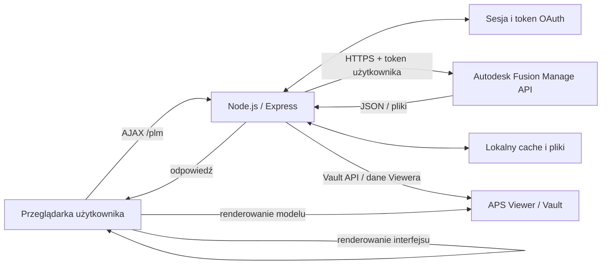

# Wymagania i zalecenia dla serwera Node.js

> Zakres analizy: kod aplikacji PLM Extensions dostępny w repozytorium, gałąź `Defro`, stan z 28 lipca 2026 r.  
> Szczegółowy opis komponentów znajduje się w dokumencie [„Architektura aplikacji Node.js”](nodejs-solution-architecture.md).

## 1. Cel aplikacji

PLM Extensions jest aplikacją internetową zbudowaną w Node.js i Express. Serwer stanowi warstwę aplikacyjną pomiędzy przeglądarką użytkownika, w której działają UX Extensions, a usługami Autodesk, przede wszystkim Autodesk Fusion Manage.

Serwer nie zastępuje Fusion Manage i nie jest głównym systemem przechowywania danych biznesowych. Jego zadania obejmują:

- uwierzytelnienie użytkownika w Autodesk Platform Services (APS),
- utrzymywanie sesji użytkownika i tokenów OAuth,
- renderowanie stron Pug oraz udostępnianie plików JavaScript, CSS i obrazów,
- przyjmowanie żądań AJAX z przeglądarki,
- wywoływanie Fusion Manage REST API za pomocą Axios,
- przekazywanie, a w części endpointów także łączenie i przekształcanie odpowiedzi,
- obsługę integracji z Autodesk Vault i opcjonalnym systemem ERP,
- obsługę załączników, pamięci podręcznej, importów, eksportów i plików Excel.

Typowy przepływ żądania wygląda następująco:



W kodzie odpowiadają za to przede wszystkim:

- `app.js` – konfiguracja Express, sesji, middleware i routingu,
- `bin/www` – uruchomienie pojedynczego serwera HTTP lub HTTPS,
- `routes/landing.js` – strony aplikacji oraz logowanie APS OAuth 2.0 z PKCE,
- `routes/plm.js` – rozbudowana warstwa integracyjna Fusion Manage,
- `routes/pdm.js` – integracja Vault,
- `routes/services.js` – pliki i usługi pomocnicze,
- `views/` – szablony Pug,
- `public/javascripts/` – logika interfejsu i przetwarzanie po stronie przeglądarki.

Repozytorium zawiera również moduł `routes/aps.js`, ale w analizowanej wersji nie jest on zarejestrowany w głównym routingu `app.js`.

## 2. Sposób działania Service Portal

Service Portal nie pobiera wszystkich danych jednym żądaniem. Podczas inicjalizacji przeglądarka uruchamia kilka zapytań, między innymi o użytkownika, sekcje workspace oraz konfigurację widoku BOM. Po otwarciu elementu uruchamiane są kolejne operacje dotyczące deskryptora, Item Details, załączników, BOM, danych Viewera oraz – zależnie od konfiguracji – Service BOM i powiązanych paneli.

Część żądań jest wykonywana równolegle. Skraca to ścieżkę krytyczną ładowania ekranu, ale oznacza również, że jeden aktywny użytkownik może w tym samym czasie wygenerować kilka połączeń do Node.js i kilka dalszych wywołań Fusion Manage API. Dlatego liczba zalogowanych użytkowników nie jest równa liczbie jednoczesnych żądań.

Duża część renderowania tabel, paneli, BOM i Viewera odbywa się w przeglądarce. Serwer nadal wykonuje jednak więcej pracy niż prosty, przezroczysty proxy: zarządza uwierzytelnieniem i sesją, buduje nagłówki dla Fusion Manage, agreguje wyniki niektórych endpointów oraz wykonuje operacje na plikach.

## 3. Co wpływa na czas odpowiedzi

W standardowym scenariuszu odczytu danych głównym składnikiem czasu jest zwykle Fusion Manage API. Na czas otwarcia ekranu wpływają przede wszystkim:

- liczba i czas odpowiedzi wywołań Fusion Manage API,
- wielkość oraz liczba poziomów struktury BOM,
- liczba pól i sekcji w Item Details,
- liczba, wielkość i typ załączników,
- dostępność danych dla APS Viewer,
- opóźnienie sieci pomiędzy serwerem Node.js a usługami Autodesk,
- liczba wywołań uruchomionych równolegle przez wszystkich użytkowników,
- czas przetwarzania i renderowania danych w przeglądarce.

Całkowity czas odczuwany przez użytkownika można w uproszczeniu zapisać jako:

```text
czas w przeglądarce
+ opóźnienie sieci przeglądarka ↔ Node.js
+ oczekiwanie i przetwarzanie w Node.js
+ ścieżka krytyczna wywołań Fusion Manage / APS / Vault
+ renderowanie interfejsu
```

Stwierdzenie, że wydajność zależy wyłącznie od PLM API, byłoby zbyt daleko idące. Dla typowych żądań JSON narzut Node.js powinien być mały, ponieważ komunikacja sieciowa przez Axios jest asynchroniczna. Node.js dobrze obsługuje wiele równoczesnych operacji I/O, jeżeli pojedyncze callbacki wykonują niewielką ilość pracy. Tak opisuje ten model również oficjalna dokumentacja [Node.js dotycząca Event Loop](https://nodejs.org/en/learn/asynchronous-work/dont-block-the-event-loop).

W analizowanym kodzie znajdują się jednak także synchroniczne operacje plikowe, np. `readFileSync`, `appendFileSync`, `readdirSync`, `writeFileSync` i `rmSync`. Występują one głównie w obsłudze cache, eksportów, importów i załączników. Podczas dużych operacji plikowych mogą blokować Event Loop i chwilowo opóźniać także innych użytkowników. Z tego powodu wydajność operacji plikowych należy testować oddzielnie od zwykłego otwierania Service Portal.

## 4. Obciążenie i współbieżność

Projekt zakłada około 200 użytkowników, z czego około 20–50 może pracować jednocześnie. Taka liczba użytkowników jest realna dla Node.js, ale sama w sobie nie pozwala zagwarantować wymaganej wydajności.

Rzeczywiste obciążenie zależy od zachowania użytkowników:

- 50 użytkowników przeglądających proste rekordy generuje inne obciążenie niż 20 użytkowników otwierających duże BOM,
- pobieranie załączników i generowanie Excela zużywa więcej pamięci oraz operacji dyskowych niż małe odpowiedzi JSON,
- funkcje masowe, takie jak Data Manager, mogą generować stały strumień zapytań przez ponad godzinę,
- równoległe żądania skracają czas pojedynczego ekranu tylko do momentu, w którym nie zostaną przekroczone możliwości API, sieci lub procesu Node.js.

APS stosuje limity liczby wywołań. Po przekroczeniu limitu usługa może zwrócić `429 Too Many Requests` wraz z nagłówkiem `Retry-After`. Autodesk zaleca buforowanie danych, ograniczenie niepotrzebnych zapytań oraz kontrolowane ponowienie po czasie wskazanym przez usługę: [APS – Rate Limiting](https://aps.autodesk.com/blog/rate-limiting) i [APS – dobre praktyki dla limitów API](https://aps.autodesk.com/blog/autodesk-platform-services-aps-api-rate-limits-best-practices-developers).

Nie należy więc zwiększać współbieżności bez pomiarów. Limit powinien być dostrojony tak, aby poprawiał przepustowość, ale nie powodował wzrostu błędów `429`, czasu oczekiwania ani zużycia pamięci.

## 5. Zalecana konfiguracja początkowa

Dla około 200 kont i 20–50 aktywnych użytkowników rozsądnym punktem startowym jest:

- 4 vCPU,
- 8 GB RAM dla profilu bez dużych operacji plikowych,
- 16 GB RAM, jeżeli regularnie przetwarzane są duże załączniki, eksporty Excel lub duże odpowiedzi BOM,
- dysk SSD,
- odpowiednia pojemność dysku dla `storage/`, `uploads/`, cache, importów i eksportów,
- stabilne łącze z niskim opóźnieniem do usług Autodesk i otwarty ruch wychodzący HTTPS,
- 64-bitowy system operacyjny,
- Node.js w obsługiwanej linii LTS,
- reverse proxy lub load balancer zapewniający TLS, limity połączeń i kompresję,
- automatyczny restart procesu po awarii oraz po restarcie systemu.

Na dzień 28 lipca 2026 r. najnowszą linią LTS jest Node.js 24, natomiast Node.js 26 pozostaje wydaniem Current do wejścia w LTS. Do produkcji należy wybierać linię Active LTS lub Maintenance LTS i wcześniej potwierdzić zgodność aplikacji. Aktualny status wersji publikuje projekt Node.js na stronie [Node.js Releases](https://nodejs.org/en/about/previous-releases).

Konfiguracja 4 vCPU / 8–16 GB RAM jest rekomendacją początkową, a nie gwarancją. Ostateczny rozmiar serwera należy określić na podstawie testów z reprezentatywnymi danymi klienta.

## 6. Ważne ograniczenie: jeden proces Node.js

`bin/www` uruchamia obecnie jeden proces aplikacji i jedno wywołanie `server.listen()`. Jeden proces Node.js wykorzystuje jeden główny Event Loop do wykonywania kodu JavaScript. Cztery przydzielone rdzenie pomagają systemowi operacyjnemu, operacjom sieciowym i pracy bibliotek, ale aplikacja nie zacznie automatycznie wykonywać callbacków JavaScript na czterech rdzeniach.

Przy wysokim obciążeniu można uruchomić kilka instancji za pomocą menedżera procesów, kontenerów lub klastra i rozdzielać ruch load balancerem. Jest to zgodne z [zaleceniami produkcyjnymi Express](https://expressjs.com/en/advanced/best-practice-performance/). Nie należy jednak robić tego przed rozwiązaniem kwestii sesji i lokalnych plików.

## 7. Sesje i skalowanie poziome

Kod używa `express-session` bez skonfigurowanego zewnętrznego `store`, czyli korzysta z domyślnego `MemoryStore`. Oficjalna dokumentacja ostrzega, że `MemoryStore` nie jest przeznaczony do produkcji, nie skaluje się poza jeden proces i może powodować problemy z pamięcią: [Express Session](https://expressjs.com/en/resources/middleware/session/).

Ma to bezpośrednie znaczenie dla tej aplikacji, ponieważ sesja zawiera tokeny Autodesk i dane użytkownika. Przy wielu procesach żądanie może trafić do instancji, która nie zna danej sesji.

Przed uruchomieniem klastra lub więcej niż jednej repliki należy:

1. przenieść sesje do współdzielonego magazynu, np. Redis albo odpowiedniej bazy danych,
2. użyć jednego bezpiecznego sekretu sesji pobieranego z menedżera sekretów lub zmiennej środowiskowej,
3. ustawić bezpieczne parametry cookie (`secure`, `httpOnly`, właściwe `sameSite` i czas życia),
4. zdecydować, czy `storage/`, cache i eksporty mają być na współdzielonym dysku, czy przypisane do konkretnej instancji,
5. dopiero potem włączyć wiele procesów i load balancing.

Sticky sessions mogą być rozwiązaniem przejściowym, ale współdzielony magazyn sesji jest bezpieczniejszą podstawą dla wysokiej dostępności.

## 8. Uwierzytelnienie i czas życia tokenu

Aplikacja realizuje trójstronny OAuth 2.0 z PKCE. Przeglądarka jest przekierowywana do APS, a serwer wymienia kod autoryzacyjny i `code_verifier` na token dostępu oraz refresh token. Autodesk opisuje ten przepływ w dokumentacji [APS Authentication API](https://aps.autodesk.com/developer/overview/authentication-api).

W analizowanej wersji kodu:

- access token, refresh token i czas wygaśnięcia są zapisywane w sesji,
- czas wygaśnięcia jest pomniejszany o 90 sekund jako margines bezpieczeństwa,
- przy otwarciu strony wygasła sesja prowadzi do ponownego logowania,
- nie ma centralnego, automatycznego odświeżenia tokenu przed każdym wywołaniem `/plm`.

Ostatni punkt jest istotny dla operacji trwających dłużej niż czas życia access tokenu, na przykład dla masowego przetwarzania w Data Manager. Sama obecność refresh tokenu w sesji nie przedłuża automatycznie access tokenu. Serwer powinien odświeżać token przed wygaśnięciem, zapewnić tylko jedno odświeżenie dla wielu równoległych żądań tej samej sesji, zapisać nowy refresh token i bezpiecznie obsłużyć nieudane odświeżenie.

## 9. Odporność komunikacji z Fusion Manage

Większość wywołań Axios do Fusion Manage w analizowanym kodzie nie ma wspólnej polityki timeoutów i ponowień. W produkcji zaleca się centralnego klienta HTTP lub interceptory zapewniające:

- rozsądny timeout połączenia i odpowiedzi,
- anulowanie zapytania, gdy klient przerwał żądanie,
- kontrolowane ponowienia dla przejściowych błędów sieciowych oraz wybranych odpowiedzi `5xx`,
- obsługę `429` zgodnie z `Retry-After`,
- automatyczne odświeżenie tokenu przed wygaśnięciem,
- ograniczenie współbieżności dla operacji masowych,
- identyfikator korelacyjny pozwalający połączyć log przeglądarki, Node.js i odpowiedź Autodesk.

Ponawianie operacji zapisujących wymaga ostrożności. Po błędzie timeout nie zawsze wiadomo, czy Fusion Manage wykonał operację. Automatyczny retry żądania `POST`, `PATCH` lub `PUT` może więc utworzyć duplikat albo powtórzyć zmianę. Autodesk omawia to zagadnienie w materiale [Improving app resilience](https://aps.autodesk.com/blog/improving-app-resilience).

## 10. Monitorowanie

Obecny logger `morgan('dev')` pomaga podczas developmentu, lecz nie wystarcza do oceny wydajności produkcyjnej. Dla każdego żądania warto mierzyć osobno:

- całkowity czas obsługi przez endpoint Node.js,
- łączny czas oraz liczbę wywołań Fusion Manage wykonanych w ramach żądania,
- nazwę lokalnego endpointu i metodę HTTP,
- status odpowiedzi Node.js oraz status odpowiedzi API Autodesk,
- liczbę aktywnych i oczekujących żądań,
- błędy `401`, `403`, `429`, `5xx`, timeouty i ponowienia,
- wielkość odpowiedzi i transfer załączników,
- wykorzystanie CPU, RSS, heap oraz częstotliwość pracy Garbage Collectora,
- opóźnienie Event Loop,
- wykorzystanie i wolne miejsce na dysku,
- liczbę aktywnych sesji.

Node.js udostępnia `process.cpuUsage()`, `process.memoryUsage()` i `process.memoryUsage.rss()` do pomiarów procesu oraz `perf_hooks.monitorEventLoopDelay()` do pomiaru opóźnienia Event Loop: [Process](https://nodejs.org/api/process.html) i [Performance measurement APIs](https://nodejs.org/api/perf_hooks.html).

W logach nie wolno zapisywać access tokenów, refresh tokenów, sekretów klienta ani pełnych danych osobowych. Dla czasu odpowiedzi należy raportować co najmniej percentyle p50, p95 i p99, ponieważ sama średnia ukrywa pojedyncze bardzo wolne żądania.

## 11. Plan testów wydajnościowych

Test powinien odwzorowywać rzeczywiste zachowanie użytkowników, a nie tylko wielokrotnie wywoływać jeden prosty endpoint.

Zalecane scenariusze:

1. logowanie i otwarcie Service Portal,
2. otwarcie elementu z małym, średnim i dużym BOM,
3. wczytanie Item Details i załączników,
4. uruchomienie Viewera,
5. przechodzenie pomiędzy elementami,
6. równoległa praca 20, 35 i 50 użytkowników,
7. krótkotrwały skok ruchu,
8. eksport lub import plików w czasie normalnej pracy użytkowników,
9. długotrwały proces Data Manager przekraczający godzinę,
10. zachowanie po `401`, `429`, timeout i przejściowym `5xx`.

Test należy przeprowadzić w dwóch wariantach:

- z kontrolowanym mockiem API, aby zmierzyć narzut samego Node.js,
- z rzeczywistym środowiskiem testowym Fusion Manage, aby zmierzyć pełny czas i ograniczenia API.

Podczas testu trzeba porównać całkowity czas endpointu z czasem wywołań zewnętrznych. Dopiero taka różnica pokaże, czy wąskim gardłem jest Fusion Manage, sieć, Node.js czy przeglądarka.

Kryteria akceptacji – docelowe p95/p99, maksymalny odsetek błędów i dopuszczalny czas ładowania dużego BOM – powinny zostać uzgodnione z użytkownikami biznesowymi przed testem.

## 12. Zalecenia produkcyjne wynikające z przeglądu kodu

Przed uruchomieniem produkcyjnym dla 200 użytkowników zaleca się, według priorytetu:

1. wdrożyć centralne odświeżanie tokenów OAuth dla wszystkich endpointów korzystających z sesji,
2. zastąpić `MemoryStore` współdzielonym magazynem sesji,
3. przenieść sekret sesji i pozostałe sekrety do bezpiecznej konfiguracji środowiskowej,
4. wymusić HTTPS; produkcja nie powinna niezauważenie przechodzić na HTTP po braku certyfikatu,
5. dodać wspólne timeouty, obsługę `429` i kontrolowane retry,
6. ograniczyć lub zastąpić synchroniczne operacje plikowe wykonywane podczas obsługi żądań,
7. dodać monitoring czasów Fusion Manage API, Event Loop, CPU, pamięci i dysku,
8. skonfigurować reverse proxy oraz automatyczny restart procesu,
9. po przeniesieniu sesji i plików współdzielonych rozważyć co najmniej dwie instancje dla wysokiej dostępności,
10. przypiąć wersje zależności zamiast używać `*`, korzystać z `package-lock.json` i instalować przez `npm ci`,
11. określić maksymalny potrzebny rozmiar żądania; obecny limit parsera wynosi 50 MB i przy wielu równoczesnych żądaniach może zwiększać zużycie pamięci,
12. zabezpieczyć dostęp do katalogu `/storage` i wyłączyć publiczne listowanie plików, jeżeli nie jest wymagane biznesowo.

Node.js rekomenduje wersje LTS, nieblokowanie Event Loop oraz kontrolę zależności. Express rekomenduje dla produkcji między innymi `NODE_ENV=production`, reverse proxy, automatyczny restart, bezpieczne cookies i skalowalny magazyn sesji. Źródła:

- [Node.js – Don't Block the Event Loop](https://nodejs.org/en/learn/asynchronous-work/dont-block-the-event-loop)
- [Node.js – Release schedule](https://nodejs.org/en/about/previous-releases)
- [Node.js – Security Best Practices](https://nodejs.org/en/learn/getting-started/security-best-practices)
- [Express – Performance and reliability](https://expressjs.com/en/advanced/best-practice-performance/)
- [Express – Security best practices](https://expressjs.com/en/advanced/best-practice-security/)
- [Express Session – wymagania magazynu sesji](https://expressjs.com/en/resources/middleware/session/)
- [APS – Authentication API](https://aps.autodesk.com/developer/overview/authentication-api)
- [APS – Rate Limiting](https://aps.autodesk.com/blog/rate-limiting)
- [APS – Improving app resilience](https://aps.autodesk.com/blog/improving-app-resilience)

## 13. Podsumowanie

Dla typowego korzystania z Service Portal główny udział w czasie odpowiedzi będzie miał Fusion Manage API oraz rozmiar pobieranych danych. Architektura asynchroniczna Node.js dobrze pasuje do roli warstwy integracyjnej i powinna obsłużyć zakładane 20–50 aktywnych użytkowników na konfiguracji początkowej 4 vCPU i 8–16 GB RAM.

Nie można jednak potwierdzić docelowej pojemności wyłącznie na podstawie liczby użytkowników. Aktualna implementacja jest pojedynczym procesem, używa sesji w pamięci i zawiera synchroniczne operacje plikowe. Przed skalowaniem oraz wdrożeniem o wymaganej wysokiej dostępności należy najpierw uporządkować sesje, tokeny, timeouty, obsługę limitów API i monitoring.

Ostateczna konfiguracja serwera powinna wynikać z testu z rzeczywistymi BOM, polami, załącznikami i profilem ruchu klienta. Najważniejszym wynikiem takiego testu nie jest samo użycie CPU, lecz rozdzielenie czasu pomiędzy przeglądarkę, Node.js i poszczególne wywołania Fusion Manage API.
